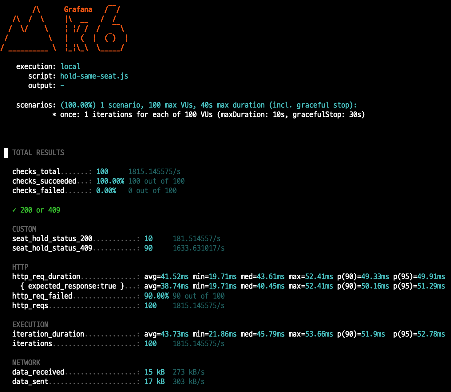

# 동시성 제어 없는 좌석 선점의 문제
콘서트 티켓팅 서비스에서 유저를 화나게 하는 것은 좌석을 선택했을 때 "이미 선택된 좌석입니다." 메시지를 보는 것보다 좌석을 잡고 마음 놓고 결제를 했는데 마지막에 결제 버튼을 누르니 "이미 예약된 좌석입니다." 메시지가 뜨면서 실패하는 경우일 것입니다.

이번 결과 리포트에서는 동시성 제어 장치를 아무것도 적용하지 않았을 때, 좌석 선점 단계에서 데이터 정합성이 어떻게 깨지는지 테스트를 통해 숫자로 확인해보았습니다.

## 1. 테스트 목표
- 락 없이 한 좌석에 다수의 요청이 몰릴 때 발생하는 현상 재현
- 왜 락이 필요할까?를 이론이 아닌 초과 예약 발생 데이터로 증명
---
## 2. 테스트 환경 및 시나리오
하나의 좌석을 두고 100명이 동시에 좌석 선점을 하는 상황을 시뮬레이션했습니다.
- 엔드포인트: `POST /api/performances/1/seats/1/hold`
- 부하테스트 툴: k6
- 트래픽 시나리오:
  - 가상 유저 수: 100명
  - 각 유저가 동시에 딱 한 번만 클릭

### 사전 준비
테스트의 정확성을 위해 실행 전 공연/회차/좌석 등의 더미데이터를 생성해두었습니다.
또한, 테스트 대상인 좌석을 선점 가능 상태(AVAILABIE)로 초기화했습니다.

```SQL
UPDATE performance_seats
SET status = 'AVAILABLE',
    reserved_by = NULL,
    reserved_at = NULL
WHERE performance_id = 1
  AND seat_id = 1;
```
---
## 3. 테스트 실행 및 결과
k6 스크립트를 실행하여 100명의 유저를 동시에 진입시켰습니다.
```bash
k6 run scripts/k6/hold-same-seat.js
```

### 측정 결과 

- 선점 성공(200 OK): 10건
- 선점 실패(409 Conflict): 90건
- 응답 속도(p95): 49.91ms

> k6는 409응답을 에러로 간주하지만, 비즈니스 로직상 선점 실패는 정상적인 방어 로직입니다. 중요한 건 성공이 1건이어야 하는데, 10건이 발생했다는 점입니다.

---

## 4. 결과 분석
이 결과는 전형적으로 읽고-쓰는 패턴에서 발생합니다. 데이터를 조회했을 당시에 락이 걸려있지 않기 때문에, 트랜잭션이 다음과 꼬이게 됩니다.
1. User A가 좌석 상태 확인: 좌석 상태 `AVAILABLE`
2. User B도 동시에 좌석 상태 확인: 좌석 상태 `AVAILABLE`
3. User A가 본인 이름으로 선점: 상태를 `HOLD`로 변경
4. User B도 본인 이름으로 선점: User A의 선점 사실을 모른 패 덮어씌움 (Lost Update)

테스트 결과, 짧은 틈 사이에 10개의 스레드가 동시에 SELECT를 통과했고, 서로의 업데이트를 덮어쓰며 10명의 유저가 동시에 본인이 선점했다고 믿는 상황이 발생했습니다.

결국 이 10명 중 실제 결제에 성공하는 건 마지막에 업데이트한 1명 뿐이고, 나머지 9명은 결제 도중 오류를 겪게 되며 최악의 UX를 겪게 됩니다.

---

## 5. 해결 방안
선점 단계에서의 데이터 정합성이 깨지는 것을 확인했으니, 동시성 제어가 필요합니다.
다음 결과 리포트에서는 동시성 제어를 활용하여 중복 좌석 선점 이슈를 해결해보겠습니다.