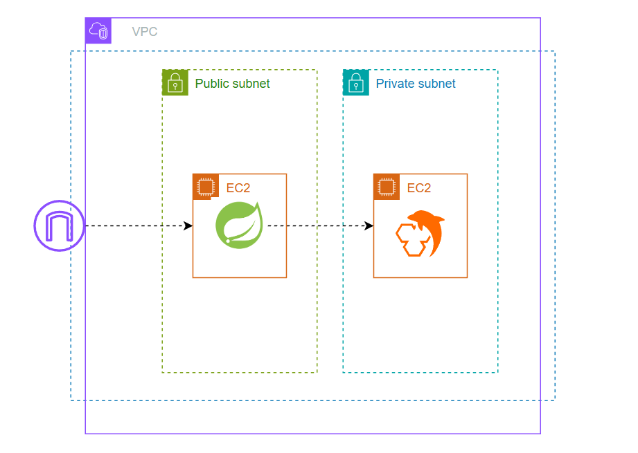
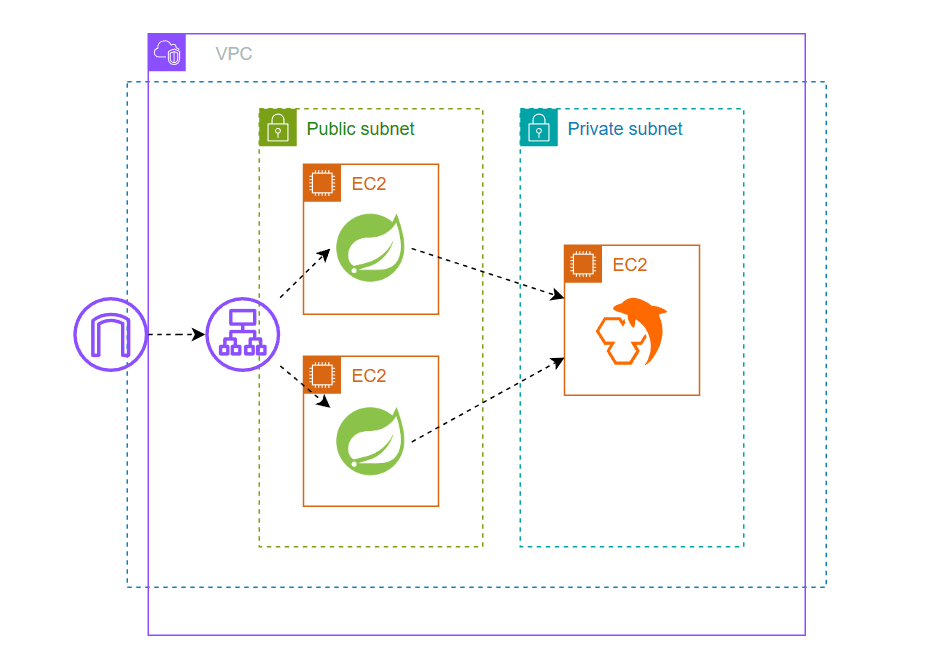

# 02. `synchronized` 적용과 분산 환경의 한계
애플리케이션 레벨에서 `synchronized` 키워드를 메서드에 적용하여, 특정 좌석에 대해 한 번에 하나의 스레드만 선점 로직을 수행할 수 있도록 코드를 변경했습니다.

```java
@Service
@RequiredArgsConstructor
public class SeatHoldService {
	private final SeatHoldTxService seatHoldTxService;
	private final ConcurrentMap<Long, Object> seatLocks = new ConcurrentHashMap<>();

	public void hold(Long performanceId, Long seatId, Long userId) {
		Object lock = seatLocks.computeIfAbsent(seatId, key -> new Object());

		synchronized (lock) {
			// 락 대기 시간 방지를 위해 별도 트랜잭션으로 분리
			seatHoldTxService.hold(performanceId, seatId, userId);
		}
	}
}
```
해당 방식이 단일 서버를 넘어선 분산 환경에서도 유효한지 검증해보았습니다.

---
## 1. 테스트 단계별 검증
### 1-1. 단일 인스턴스 검증



먼저 로직 자체가 정상적으로 동작하는지 확인하기 위해, 단일 서버(1대) 환경에서 테스트를 수행했습니다.
- 환경: EC2 1대
- 시나리오: 100명의 유저가 동시 요청
  
결과 확인
- 선점 성공 (200 OK): 1건 (정상)
- 선점 실패 (409 Conflict): 99건

<details> <summary> k6 테스트 결과</summary>

```
...
✓ 200 or 409

CUSTOM
seat_hold_status_200...........: 1      1.407507/s
seat_hold_status_409...........: 99     139.343176/s
...
```
</details>

---
### 1-2. 멀티 인스턴스 검증



실제 배포 환경과 유사하게 ALB(Load Balancer) 뒤에 2대의 인스턴스를 배치하여 동일한 테스트를 진행했습니다.
- 환경: ALB(Round Robin) → EC2 2대
- 시나리오: 100명의 유저가 동시 요청 (트래픽 분산)

결과 확인
- 선점 성공 (200 OK): 2건 (비정상)
- 선점 실패 (409 Conflict): 98건

<details> <summary> k6 테스트 결과</summary>

```
...
✓ 200 or 409

CUSTOM
seat_hold_status_200...........: 2      3.7994/s
seat_hold_status_409...........: 98     186.170624/s
...
```
</details>

---
## 2. 결과 분석
단일 서버에서는 정상이었던 로직이 서버를 2대로 늘렸을 때 중복 선점이 발생했습니다.
1. 동작 원리: `synchronized`는 단일 JVM 프로세스 내부의 스레드 간 동기화만 보장합니다.
2. 한계: 서로 다른 물리적 서버(인스턴스)는 JVM 메모리 공간을 공유하지 않습니다. 즉 서버 A의 락이 서버 B의 진입을 막을 수 없습니다.
3. 현상:
   - 요청 A → ALB → Server A (Lock 획득 → 선점 성공)
   - 요청 B → ALB → Server B (Lock 획득 → 선점 성공)
   - 결과적으로 두 트랜잭션이 동시에 커밋되어 정합성이 깨집니다.
---

## 3. 향후 계획
테스트를 통해 애플리케이션 레벨의 락(`synchronized`)은 분산 환경에서 데이터 정합성을 보장할 수 없다는 것을 확인했습니다.
따라서 분산 환경에서도 유일성을 보장하기 위해, 애플리케이션이 외부의 인프라(DB, Redis 등)를 활용한 락 메커니즘이 필요합니다.

다음 단계에서는 DB 락을 활용한 동시성 제어를 통해 분산 환경에서의 데이터 정합성 문제를 어떻게 해결하는지 검증하고 분석해보겠습니다.